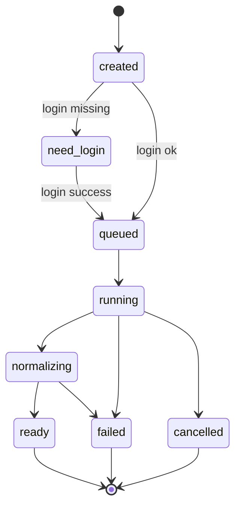

# MediaCrawler MCP 工程设计文档

## 1. 设计目标

本文描述 MediaCrawler Research MCP 的工程落地方案，承接以下文档：

- [数据采集分析 MCP 产品需求文档](数据采集分析MCP_PRD.md)
- [技术选型与架构决策](技术选型与架构决策.md)
- [服务器登录态与飞书二维码方案](服务器登录态与飞书二维码方案.md)

第一版目标是把 MediaCrawler 从“人工执行爬虫脚本 + 人工找文件分析”升级为“Hermes Agent 可调用的数据集采集、查询和分析工具”。

开发任务拆分详见 [MediaCrawler MCP 开发任务拆分](MediaCrawler_MCP_开发任务拆分.md)。

第一版优先跑通：

- stdio MCP server。
- 小红书单平台最小闭环。
- 服务端二维码登录，二维码由 Hermes 发到飞书。
- 创建数据集。
- 启动采集任务。
- 查询任务状态。
- 原始 JSONL 落盘。
- DuckDB 标准化查询。
- Markdown、HTML、JSON 摘要报告。

第一版不追求：

- 多账号池。
- 大规模并发采集。
- Web UI。
- HTTP MCP。
- 飞书 SDK 内置。
- MCP 内置复杂 LLM 总结。

## 2. 总体架构

```text
Feishu User
  |
  v
Hermes Agent
  |
  | stdio MCP
  v
MediaCrawler MCP Server
  |
  |-- mcp_server        MCP 工具入口
  |-- dataset_service   数据集创建、读取、元数据维护
  |-- task_manager      任务状态、subprocess 调度
  |-- crawler_runner    调用 MediaCrawler 采集逻辑
  |-- login_manager     登录态、二维码、cookie import
  |-- normalizer        JSONL -> DuckDB
  |-- query_engine      DuckDB 查询
  |-- report_service    报告生成
  |-- storage           SQLite、文件路径、目录管理
  |
  |-- SQLite metadata
  |-- DuckDB analysis
  |-- raw JSONL files
  |-- Playwright profiles
```

Hermes 负责：

- 理解用户意图。
- 调用 MCP 工具。
- 将二维码图片路径发送到飞书。
- 在登录成功后恢复原采集任务。
- 基于 MCP 返回的结构化摘要做自然语言回复。

MediaCrawler MCP 负责：

- 管理数据集、任务、登录会话和报告。
- 调用 MediaCrawler 完成实际采集。
- 保存原始数据和标准化数据。
- 生成可被 Hermes 使用的报告和查询结果。

## 3. 代码模块划分

建议新增 `mediacrawler_mcp` 包，与现有 `analysis` 包并列。

```text
mediacrawler_mcp/
  __init__.py
  server.py
  config.py
  models.py
  storage.py
  dataset_service.py
  task_manager.py
  crawler_runner.py
  login_manager.py
  normalizer.py
  query_engine.py
  report_service.py
  errors.py
  utils.py
```

### 3.1 `server.py`

职责：

- 启动 stdio MCP server。
- 注册 MCP tools。
- 做输入校验和输出封装。
- 将请求转发到 service 层。

不负责：

- 直接操作 SQLite。
- 直接拼接爬虫命令。
- 直接生成报告。

### 3.2 `config.py`

职责：

- 读取环境变量。
- 维护默认路径。
- 维护浏览器模式配置。

建议配置：

```text
MEDIACRAWLER_MCP_HOME=~/.mediacrawler-mcp
MEDIACRAWLER_MCP_BROWSER_MODE=persistent_context
MEDIACRAWLER_MCP_CDP_ENDPOINT=
MEDIACRAWLER_MCP_MAX_CONCURRENT_TASKS=1
MEDIACRAWLER_MCP_DEFAULT_TIMEOUT_SECONDS=300
```

### 3.3 `models.py`

职责：

- 定义 Pydantic 或 dataclass 模型。
- 统一 Dataset、Task、Report、LoginSession 的字段。

建议核心模型：

- `Dataset`
- `Task`
- `LoginSession`
- `Report`
- `ToolResult`
- `DatasetOptions`
- `CollectionOptions`

### 3.4 `storage.py`

职责：

- 初始化 SQLite。
- 创建数据集目录。
- 管理文件路径。
- 提供 repository 方法。

不负责：

- 采集。
- 分析。
- 业务判断。

### 3.5 `dataset_service.py`

职责：

- 创建数据集。
- 查询数据集列表。
- 读取数据集详情。
- 更新 dataset.json。
- 同步 SQLite 元数据。

### 3.6 `task_manager.py`

职责：

- 创建任务。
- 启动 subprocess。
- 更新任务状态。
- 读取任务日志。
- 取消任务。

任务状态只反映执行事实，不做业务分析。

### 3.7 `crawler_runner.py`

职责：

- 根据 dataset 和 collection options 生成 MediaCrawler 执行参数。
- 调用现有 `main.py` 或更细粒度采集入口。
- 将采集产物写入或搬运到 dataset raw 目录。
- 记录 stdout、stderr 和日志路径。

第一版可以通过 subprocess 调用现有 CLI，后续再逐步拆为库调用。

### 3.8 `login_manager.py`

职责：

- 检查平台登录态。
- 启动登录流程。
- 输出二维码 PNG。
- 轮询登录状态。
- 导入 cookie。
- 清除登录态。

第一版优先支持小红书。

### 3.9 `normalizer.py`

职责：

- 读取 raw JSONL。
- 映射平台字段。
- 写入 DuckDB。
- 保留 `raw_json`。
- 保证 `source_keyword` 进入每条内容和评论。

可复用当前 `analysis/loaders.py` 中的加载能力，但 normalizer 应面向数据集目录和 DuckDB。

### 3.10 `query_engine.py`

职责：

- 基于 DuckDB 查询标准化后的内容和评论。
- 支持关键词搜索、平台过滤、source_keyword 过滤。
- 支持按互动数、点赞数、发布时间排序。

### 3.11 `report_service.py`

职责：

- 调用现有 `analysis` 包能力。
- 生成 Markdown 报告。
- 生成 HTML 报告。
- 生成 summary JSON。
- 生成 CSV 明细和词云。

第一版可以复用 `analysis/reports.py`，后续再把数据集报告逻辑抽出。

### 3.12 `errors.py`

职责：

- 定义统一错误码。
- 将内部异常转换为 MCP 可读错误。

## 4. 数据目录结构

第一版默认使用用户目录，避免污染项目仓库。

```text
~/.mediacrawler-mcp/
  metadata.sqlite
  logs/
    mcp-server.log
  browser_profiles/
    xhs/default/
    dy/default/
  login_qrcodes/
    xhs-login-20260627-221500.png
  datasets/
    ds_20260627_221500_ai_coding_side_hustle/
      dataset.json
      raw/
        xhs_contents.jsonl
        xhs_comments.jsonl
      logs/
        collect_xhs.log
      analysis.duckdb
      reports/
        report.md
        report.html
        summary.json
        top_contents.csv
        top_comments.csv
        comment_word_freq.json
        comment_word_cloud.png
```

本地开发可以允许通过配置改到项目内：

```text
data/mcp/
```

但服务器默认不建议写入 git workspace。

## 5. SQLite 表设计

SQLite 用于元数据和任务状态，不存大体量内容和评论正文。

### 5.1 `datasets`

```sql
CREATE TABLE datasets (
  dataset_id TEXT PRIMARY KEY,
  name TEXT NOT NULL,
  description TEXT,
  status TEXT NOT NULL,
  platforms_json TEXT NOT NULL,
  keywords_json TEXT NOT NULL,
  options_json TEXT NOT NULL,
  dataset_dir TEXT NOT NULL,
  created_at TEXT NOT NULL,
  updated_at TEXT NOT NULL,
  last_crawled_at TEXT,
  content_count INTEGER DEFAULT 0,
  comment_count INTEGER DEFAULT 0,
  warning_count INTEGER DEFAULT 0,
  error_count INTEGER DEFAULT 0
);
```

### 5.2 `tasks`

```sql
CREATE TABLE tasks (
  task_id TEXT PRIMARY KEY,
  dataset_id TEXT NOT NULL,
  task_type TEXT NOT NULL,
  status TEXT NOT NULL,
  progress REAL DEFAULT 0,
  platforms_json TEXT,
  keywords_json TEXT,
  options_json TEXT,
  pid INTEGER,
  log_path TEXT,
  error_code TEXT,
  error_message TEXT,
  created_at TEXT NOT NULL,
  started_at TEXT,
  finished_at TEXT,
  updated_at TEXT NOT NULL,
  FOREIGN KEY(dataset_id) REFERENCES datasets(dataset_id)
);
```

### 5.3 `login_sessions`

```sql
CREATE TABLE login_sessions (
  login_session_id TEXT PRIMARY KEY,
  platform TEXT NOT NULL,
  account_name TEXT,
  status TEXT NOT NULL,
  qr_image_path TEXT,
  profile_dir TEXT,
  expires_at TEXT,
  message TEXT,
  created_at TEXT NOT NULL,
  updated_at TEXT NOT NULL
);
```

### 5.4 `reports`

```sql
CREATE TABLE reports (
  report_id TEXT PRIMARY KEY,
  dataset_id TEXT NOT NULL,
  report_type TEXT NOT NULL,
  status TEXT NOT NULL,
  report_md_path TEXT,
  report_html_path TEXT,
  summary_json_path TEXT,
  created_at TEXT NOT NULL,
  updated_at TEXT NOT NULL,
  FOREIGN KEY(dataset_id) REFERENCES datasets(dataset_id)
);
```

### 5.5 `accounts`

```sql
CREATE TABLE accounts (
  account_id TEXT PRIMARY KEY,
  platform TEXT NOT NULL,
  account_name TEXT,
  profile_dir TEXT NOT NULL,
  status TEXT NOT NULL,
  last_login_at TEXT,
  last_checked_at TEXT,
  created_at TEXT NOT NULL,
  updated_at TEXT NOT NULL
);
```

第一版可以只使用默认账号：

```text
account_id = <platform>:default
```

## 6. DuckDB 表设计

DuckDB 用于每个 dataset 的分析查询。第一版倾向每个数据集一个 `analysis.duckdb`。

### 6.1 `contents`

```sql
CREATE TABLE contents (
  dataset_id TEXT,
  platform TEXT,
  source_keyword TEXT,
  content_id TEXT,
  author_id TEXT,
  author_name TEXT,
  title TEXT,
  desc TEXT,
  content_text TEXT,
  url TEXT,
  publish_time TEXT,
  like_count BIGINT,
  comment_count BIGINT,
  share_count BIGINT,
  collect_count BIGINT,
  engagement_count BIGINT,
  crawl_time TEXT,
  raw_json JSON
);
```

### 6.2 `comments`

```sql
CREATE TABLE comments (
  dataset_id TEXT,
  platform TEXT,
  source_keyword TEXT,
  content_id TEXT,
  comment_id TEXT,
  parent_comment_id TEXT,
  user_id TEXT,
  user_name TEXT,
  comment_text TEXT,
  like_count BIGINT,
  publish_time TEXT,
  crawl_time TEXT,
  raw_json JSON
);
```

### 6.3 去重策略

内容去重：

- 主键候选：`platform + content_id`。
- 重复内容保留 `engagement_count` 更高或 `crawl_time` 更新的一条。

评论去重：

- 主键候选：`platform + comment_id`。
- 缺少 `comment_id` 时使用 `platform + content_id + user_name + comment_text` 的 hash。

第一版可在 normalizer 层处理去重，再写入 DuckDB。

## 7. MCP Tool 设计

工具接口以 Hermes 易用为优先，返回结构化结果和本地路径。

### 7.1 `create_dataset`

用途：创建数据集目录和元数据，不触发采集。

输入：

```json
{
  "name": "AI 编程副业真实反馈调研",
  "description": "小红书关于 AI 编程副业和程序员接单的内容与评论",
  "platforms": ["xhs"],
  "keywords": ["AI编程副业", "程序员接单"],
  "options": {
    "crawler_type": "search",
    "max_contents": 20,
    "include_comments": true,
    "max_comments_per_content": 10
  }
}
```

输出：

```json
{
  "status": "success",
  "dataset_id": "ds_20260627_221500_ai_coding_side_hustle",
  "dataset_dir": "/root/.mediacrawler-mcp/datasets/ds_...",
  "dataset_json_path": "/root/.mediacrawler-mcp/datasets/ds_.../dataset.json"
}
```

### 7.2 `list_datasets`

用途：列出历史数据集。

输入：

```json
{
  "keyword": "接单",
  "platform": "xhs",
  "status": "ready",
  "limit": 20
}
```

输出：

```json
{
  "status": "success",
  "datasets": []
}
```

### 7.3 `get_dataset`

用途：读取数据集详情。

输入：

```json
{
  "dataset_id": "ds_20260627_221500_ai_coding_side_hustle"
}
```

输出：

```json
{
  "status": "success",
  "dataset": {}
}
```

### 7.4 `get_login_status`

用途：检查平台是否已登录。

输入：

```json
{
  "platform": "xhs"
}
```

输出：

```json
{
  "status": "logged_out",
  "platform": "xhs",
  "account_hint": null,
  "message": "小红书未登录，请调用 start_login 获取二维码"
}
```

### 7.5 `start_login`

用途：启动登录流程并生成二维码图片。

输入：

```json
{
  "platform": "xhs",
  "account_name": "default",
  "timeout_seconds": 120
}
```

输出：

```json
{
  "status": "qr_required",
  "platform": "xhs",
  "login_session_id": "login_xhs_20260627_221500",
  "qr_image_path": "/root/.mediacrawler-mcp/login_qrcodes/xhs-login-20260627-221500.png",
  "qr_image_base64": null,
  "expires_at": "2026-06-27T22:17:00+08:00",
  "message": "请使用小红书 App 扫码登录"
}
```

### 7.6 `wait_login`

用途：等待或查询登录完成状态。

输入：

```json
{
  "login_session_id": "login_xhs_20260627_221500",
  "timeout_seconds": 120
}
```

输出：

```json
{
  "status": "success",
  "platform": "xhs",
  "message": "小红书登录成功"
}
```

### 7.7 `import_cookies`

用途：导入平台 cookie。

输入：

```json
{
  "platform": "xhs",
  "cookie_string": "a=1; web_session=..."
}
```

输出：

```json
{
  "status": "success",
  "message": "cookie 已导入，请调用 get_login_status 验证"
}
```

### 7.8 `start_collection`

用途：启动采集任务。

输入：

```json
{
  "dataset_id": "ds_20260627_221500_ai_coding_side_hustle",
  "platforms": ["xhs"],
  "keywords": ["AI编程副业", "程序员接单"],
  "include_comments": true,
  "max_contents": 20,
  "max_comments_per_content": 10,
  "headless": true
}
```

输出：

```json
{
  "status": "accepted",
  "task_id": "task_collect_20260627_221501",
  "dataset_id": "ds_20260627_221500_ai_coding_side_hustle",
  "message": "采集任务已启动"
}
```

如果未登录：

```json
{
  "status": "need_login",
  "platform": "xhs",
  "message": "小红书未登录，请先调用 start_login 获取二维码"
}
```

### 7.9 `get_task_status`

用途：查询采集、标准化或报告任务状态。

输入：

```json
{
  "task_id": "task_collect_20260627_221501"
}
```

输出：

```json
{
  "status": "running",
  "task_id": "task_collect_20260627_221501",
  "progress": 0.35,
  "log_path": "/root/.mediacrawler-mcp/datasets/ds_.../logs/collect_xhs.log",
  "message": "正在采集小红书搜索结果"
}
```

### 7.10 `cancel_task`

用途：取消正在运行的任务。

输入：

```json
{
  "task_id": "task_collect_20260627_221501"
}
```

输出：

```json
{
  "status": "cancelled",
  "task_id": "task_collect_20260627_221501"
}
```

### 7.11 `normalize_dataset`

用途：将 raw JSONL 标准化到 DuckDB。

输入：

```json
{
  "dataset_id": "ds_20260627_221500_ai_coding_side_hustle",
  "force": false
}
```

输出：

```json
{
  "status": "success",
  "duckdb_path": "/root/.mediacrawler-mcp/datasets/ds_.../analysis.duckdb",
  "content_count": 40,
  "comment_count": 300
}
```

### 7.12 `query_dataset`

用途：查询历史数据集。

输入：

```json
{
  "dataset_id": "ds_20260627_221500_ai_coding_side_hustle",
  "target": "comments",
  "query": "接单 风险 不靠谱",
  "platform": "xhs",
  "source_keyword": "程序员接单",
  "limit": 10,
  "sort_by": "like_count"
}
```

输出：

```json
{
  "status": "success",
  "results": [
    {
      "platform": "xhs",
      "source_keyword": "程序员接单",
      "content_id": "...",
      "comment_id": "...",
      "text": "接单最怕遇到不付款...",
      "like_count": 42,
      "url": "https://www.xiaohongshu.com/..."
    }
  ]
}
```

### 7.13 `generate_report`

用途：生成或刷新报告。

输入：

```json
{
  "dataset_id": "ds_20260627_221500_ai_coding_side_hustle",
  "report_type": "topic_research",
  "top_n": 20,
  "group_by_keyword": true
}
```

输出：

```json
{
  "status": "success",
  "report_id": "report_20260627_222000",
  "report_md_path": "/root/.mediacrawler-mcp/datasets/ds_.../reports/report.md",
  "report_html_path": "/root/.mediacrawler-mcp/datasets/ds_.../reports/report.html",
  "summary_json_path": "/root/.mediacrawler-mcp/datasets/ds_.../reports/summary.json",
  "summary": {
    "content_count": 40,
    "comment_count": 300,
    "top_keywords": [],
    "high_engagement_posts": []
  }
}
```

### 7.14 `get_report`

用途：获取已有报告路径和摘要。

输入：

```json
{
  "dataset_id": "ds_20260627_221500_ai_coding_side_hustle",
  "report_id": null
}
```

输出：

```json
{
  "status": "success",
  "report": {
    "report_id": "report_20260627_222000",
    "report_md_path": "...",
    "report_html_path": "...",
    "summary_json_path": "..."
  }
}
```

## 8. 采集任务生命周期



状态说明：

- `created`: 任务已创建，尚未开始。
- `need_login`: 需要用户扫码或导入 cookie。
- `queued`: 等待执行。
- `running`: 正在采集。
- `normalizing`: 采集完成，正在写入 DuckDB。
- `ready`: 任务完成，数据集可查询。
- `failed`: 任务失败。
- `cancelled`: 用户取消。
- `interrupted`: MCP server 或 subprocess 非正常中断后恢复出的状态。

## 9. 登录态与二维码流程

```mermaid
sequenceDiagram
    participant H as Hermes
    participant M as MCP Server
    participant L as LoginManager
    participant B as Browser

    H->>M: start_collection(dataset_id)
    M->>L: get_login_status(xhs)
    L-->>M: logged_out
    M-->>H: need_login
    H->>M: start_login(xhs)
    M->>L: start_login(xhs)
    L->>B: open login page
    L->>L: save QR png
    L-->>M: qr_image_path
    M-->>H: qr_image_path
    H-->>H: send image to Feishu
    H->>M: wait_login(login_session_id)
    L->>B: poll login state
    L-->>M: success
    M-->>H: success
    H->>M: start_collection(dataset_id)
```



关键要求：

- `start_collection` 不应长时间卡在登录页。
- 未登录时必须快速返回 `need_login`。
- 二维码必须保存为本地 PNG。
- 二维码过期后返回 `expired`。
- 登录成功后持久化 profile，后续采集复用。

## 10. 数据标准化流程

```text
raw JSONL
  -> load records
  -> platform field mapping
  -> normalize numeric fields
  -> fill dataset_id/platform/source_keyword
  -> deduplicate
  -> write DuckDB contents/comments
  -> update SQLite counts
  -> update dataset.json metrics
```

### 10.1 平台字段映射

小红书：

- 内容 ID：`note_id`
- URL：`note_url`
- 评论关联字段：`note_id`

抖音：

- 内容 ID：`aweme_id`
- URL：`aweme_url`
- 评论关联字段：`aweme_id`

### 10.2 数字字段

统一转为整数：

- `liked_count`
- `collected_count`
- `comment_count`
- `share_count`
- `like_count`

缺失、空值、中文单位、异常字符串不得导致 normalizer 崩溃。

### 10.3 派生字段

内容表新增：

```text
engagement_count = like_count + collect_count + comment_count + share_count
```

## 11. 报告生成流程

报告生成基于 DuckDB 和当前 `analysis` 包能力。

```text
analysis.duckdb
  -> aggregate metrics
  -> top contents
  -> top comments
  -> comment word frequency
  -> suspected ads/lead-gen rules
  -> summary.json
  -> report.md
  -> report.html
```

### 11.1 Markdown 报告

Markdown 报告面向 Hermes 读取，结构清晰、便于摘录。

建议包含：

- 数据集概览。
- 采集范围。
- 数据质量。
- 关键词对比。
- 平台对比。
- 高互动内容。
- 高频评论词。
- 用户主要关切。
- 典型正面反馈。
- 典型负面反馈。
- 疑似广告或课程引流。
- 值得人工复看的链接。

### 11.2 HTML 报告

HTML 报告面向人工查看，第一版保持静态 HTML。

第一版不引入 ECharts 或 Plotly，避免前端复杂度。

### 11.3 规则识别

疑似广告或引流关键词第一版可用规则：

- 私信
- 进群
- 课程
- 训练营
- 副业项目
- 带你做
- 资料包
- 领取
- 加我
- 变现

规则命中结果应作为候选标记，不作为最终事实判断。

## 12. 错误处理与状态码

所有 MCP tools 返回统一结构：

```json
{
  "status": "success|accepted|running|need_login|failed",
  "message": "...",
  "error": null
}
```

失败时：

```json
{
  "status": "failed",
  "message": "小红书登录态已失效",
  "error": {
    "code": "LOGIN_EXPIRED",
    "detail": "请调用 start_login 重新扫码"
  }
}
```

### 12.1 错误码

```text
INVALID_ARGUMENT
DATASET_NOT_FOUND
TASK_NOT_FOUND
REPORT_NOT_FOUND
LOGIN_REQUIRED
LOGIN_EXPIRED
LOGIN_QR_EXPIRED
LOGIN_FAILED
CRAWLER_FAILED
CRAWLER_TIMEOUT
NORMALIZE_FAILED
QUERY_FAILED
REPORT_FAILED
UNSUPPORTED_PLATFORM
CONCURRENT_LIMIT_REACHED
INTERNAL_ERROR
```

### 12.2 用户可恢复错误

以下错误 Hermes 可以引导用户恢复：

- `LOGIN_REQUIRED`
- `LOGIN_EXPIRED`
- `LOGIN_QR_EXPIRED`
- `CONCURRENT_LIMIT_REACHED`
- `CRAWLER_TIMEOUT`

### 12.3 系统错误

以下错误需要开发者排查：

- `NORMALIZE_FAILED`
- `QUERY_FAILED`
- `REPORT_FAILED`
- `INTERNAL_ERROR`

## 13. 配置设计

建议支持环境变量和配置文件两种方式。

配置文件：

```text
~/.mediacrawler-mcp/config.yaml
```

示例：

```yaml
home_dir: ~/.mediacrawler-mcp
browser:
  mode: persistent_context
  cdp_endpoint: null
  headless: true
tasks:
  max_concurrent_tasks: 1
  default_timeout_seconds: 300
dataset:
  default_max_contents: 20
  default_include_comments: true
  default_max_comments_per_content: 10
analysis:
  top_n: 20
  enable_wordcloud: true
```

环境变量优先级高于配置文件。

## 14. 与现有代码的集成点

### 14.1 `analysis` 包

当前已有离线分析模块：

- `analysis/cli.py`
- `analysis/loaders.py`
- `analysis/reports.py`

MCP 报告服务应复用这些能力，但需要增加 dataset 级入口。

### 14.2 MediaCrawler CLI

第一版 `crawler_runner` 可以通过 subprocess 调用：

```bash
uv run python main.py --platform xhs --lt qrcode --type search --keywords "..." --save_data_option jsonl
```

后续需要解决：

- 输出目录重定向到 dataset raw。
- 多关键词对应 `source_keyword`。
- 日志路径隔离。
- 登录态 profile 路径隔离。

### 14.3 登录二维码

当前登录流程偏本地展示二维码。需要新增二维码输出抽象：

```text
local display
file png
base64
```

第一版 MCP 使用 `file png`。

## 15. 测试计划

### 15.1 单元测试

覆盖：

- dataset_id 生成。
- SQLite 初始化和 CRUD。
- dataset.json 读写。
- JSONL 加载。
- 字段标准化。
- DuckDB 写入和查询。
- 错误码转换。

### 15.2 集成测试

覆盖：

- 创建数据集。
- 使用 fixture raw JSONL normalize 到 DuckDB。
- 查询评论。
- 生成报告。
- 任务状态从 `accepted` 到 `ready`。

### 15.3 手工验证

覆盖：

- 小红书二维码登录。
- Hermes 发送二维码到飞书。
- 用户扫码后继续采集。
- 登录失效时返回 `need_login`。
- 小红书搜索采集 raw JSONL。

### 15.4 暂不自动化

第一版不强制自动化真实平台采集测试，避免依赖外部平台状态和账号登录态。

## 16. 分阶段实现计划

### Phase 1：MCP 壳与数据集元数据

目标：

- stdio MCP server 可启动。
- SQLite 初始化。
- 数据集目录可创建。

交付：

- `mediacrawler_mcp/server.py`
- `mediacrawler_mcp/storage.py`
- `mediacrawler_mcp/dataset_service.py`
- tools: `create_dataset`、`list_datasets`、`get_dataset`

### Phase 2：小红书登录闭环

目标：

- 服务端能生成小红书二维码 PNG。
- Hermes 能把二维码发给飞书用户。
- 用户扫码后登录态可复用。

交付：

- `login_manager.py`
- tools: `get_login_status`、`start_login`、`wait_login`、`import_cookies`

### Phase 3：小红书采集任务

目标：

- subprocess 启动小红书搜索采集。
- 任务状态可查询。
- raw JSONL 进入 dataset 目录。

交付：

- `task_manager.py`
- `crawler_runner.py`
- tools: `start_collection`、`get_task_status`、`cancel_task`

### Phase 4：DuckDB 标准化与查询

目标：

- raw JSONL 标准化进 DuckDB。
- Hermes 可查询历史评论和内容。

交付：

- `normalizer.py`
- `query_engine.py`
- tools: `normalize_dataset`、`query_dataset`

### Phase 5：报告生成

目标：

- 生成 Markdown、HTML、summary JSON。
- 报告支持关键词对比和基础广告/引流规则。

交付：

- `report_service.py`
- tools: `generate_report`、`get_report`

### Phase 6：抖音与多关键词增强

目标：

- 接入抖音。
- 支持多关键词串行采集。
- 报告支持平台和关键词对比。

## 17. 验收标准

第一版验收：

- Hermes 能通过 stdio MCP 创建数据集。
- 未登录小红书时，采集返回 `need_login`。
- MCP 能生成二维码 PNG 路径。
- Hermes 能将二维码发到飞书。
- 用户扫码后，小红书登录态可复用。
- MCP 能启动小红书采集任务，并返回 task_id。
- `get_task_status` 能看到任务完成或失败。
- 原始 JSONL 写入 dataset raw 目录。
- DuckDB 中存在标准化 `contents` 和 `comments` 表。
- `query_dataset` 能查询历史评论。
- `generate_report` 能输出 Markdown、HTML、summary JSON。

## 18. 未决问题

- 现有 MediaCrawler CLI 输出目录如何最小改造到 dataset raw。
- 小红书二维码 DOM 获取和 PNG 保存需要实际验证。
- 抖音登录态是否需要额外保存 localStorage。
- DuckDB 每数据集一个库还是全局一个库，第一版暂定每数据集一个库。
- MCP Python SDK 的具体版本和 Hermes 配置格式需要在服务器环境验证。
