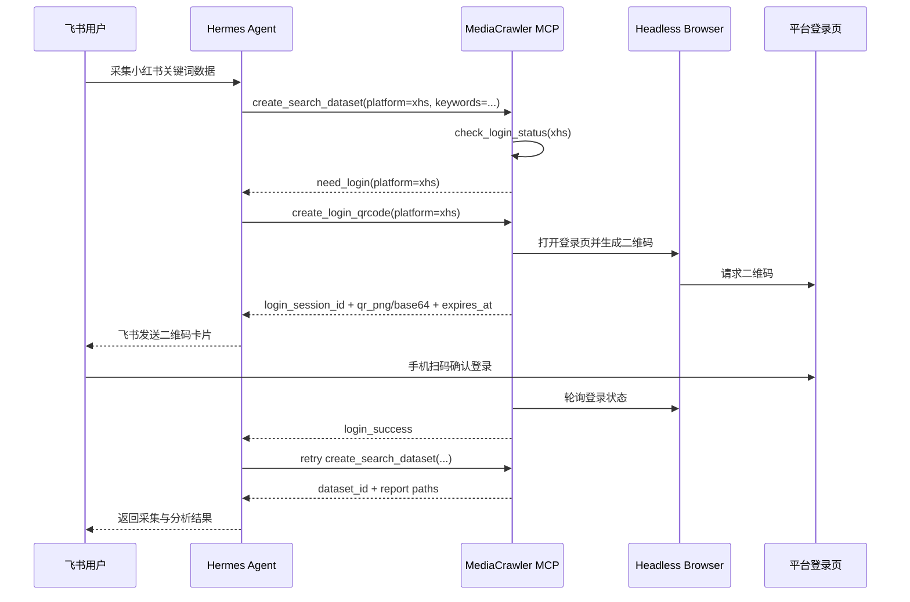

# 服务器登录态与飞书二维码方案

## 1. 背景

MediaCrawler 当前的采集流程通常依赖浏览器登录态。以小红书为例，本地开发时可以通过程序拉起浏览器并扫码登录；但当采集能力部署到服务器、再由 Hermes Agent 通过 MCP 调用时，服务器往往没有可见浏览器窗口，用户也无法直接看到二维码。

这会导致两个问题：

- 采集任务在未登录时容易卡住或失败。
- Agent 无法把“需要用户扫码”这个状态自然传达给飞书里的真实用户。

Agent Reach 的小红书接入方式提供了一个有价值的参考：它在服务器场景推荐 `xiaohongshu-mcp`，通过 `check_login_status` 和 `get_login_qrcode` 暴露登录状态与二维码，再由上层 Agent 把二维码交给用户扫码。

本方案记录 MediaCrawler Research MCP 后续应补齐的服务器登录态能力。

## 2. 核心判断

CDP 不是免登录方案。

CDP 的作用是连接或启动一个真实浏览器，并复用这个浏览器的 profile、cookie、localStorage 等登录状态。它可以降低自动化痕迹，也方便复用已有浏览器会话，但不能绕过首次登录。

服务器场景真正需要的是一套登录态管理闭环：

- 能检测某个平台是否已登录。
- 未登录时能生成二维码，并把二维码交给用户。
- 用户扫码后能确认登录成功。
- 登录态能持久化保存，供后续采集任务复用。
- 登录失效时能返回明确的 `need_login` 状态，而不是让任务卡死。

## 3. 产品目标

在 Hermes Agent 接入飞书的场景下，实现如下体验：

1. 用户在飞书里请求：“帮我采集小红书上某个关键词的数据。”
2. Hermes 调用 MediaCrawler Research MCP 创建采集任务。
3. MCP 发现小红书未登录，返回 `need_login`。
4. Hermes 调用 MCP 获取登录二维码。
5. Hermes 将二维码图片通过飞书机器人发给用户。
6. 用户用手机扫码登录。
7. MCP 轮询或接收登录完成状态。
8. Hermes 继续执行原采集任务。

## 4. 推荐流程

## 5. MCP 能力设计

### 5.1 `check_login_status`

用途：检查指定平台当前是否可执行采集。

输入：

- `platform`: `xhs`、`dy`，后续扩展其他平台。

输出：

- `status`: `logged_in`、`logged_out`、`expired`、`unknown`。
- `account_hint`: 可选，脱敏昵称或账号标识。
- `expires_hint`: 可选，登录态可能过期的提示。
- `message`: 面向 Agent 和用户的可读说明。

### 5.2 `create_login_qrcode`

用途：在服务器端启动或复用浏览器会话，生成登录二维码。

输入：

- `platform`
- `delivery`: `raw`、`feishu`，v1 可只实现 `raw`，由 Hermes 负责飞书发送。
- `timeout_seconds`: 默认 120。

输出：

- `login_session_id`
- `qr_png_path`: 本地二维码图片路径。
- `qr_base64`: 可选，便于直接上传飞书图片。
- `expires_at`
- `poll_interval_seconds`
- `message`

### 5.3 `wait_login`

用途：等待用户扫码完成，或查询某个登录会话当前状态。

输入：

- `login_session_id`
- `timeout_seconds`

输出：

- `status`: `pending`、`success`、`expired`、`failed`。
- `message`

### 5.4 `import_cookies`

用途：允许用户通过 Cookie-Editor 等方式导出 cookie 后，由 Hermes 或管理员导入服务器。

输入：

- `platform`
- `cookie_string`

输出：

- `status`
- `message`

说明：

- 小红书当前代码主要使用 `web_session`，但后续服务器化建议保留完整 cookie string，避免过早丢失平台需要的其他字段。
- 抖音可能同时依赖 cookie 与 localStorage 状态，不能只假设 cookie 一定足够。

### 5.5 `logout`

用途：清除指定平台的服务器登录态。

输入：

- `platform`

输出：

- `status`
- `message`

## 6. 飞书集成建议

v1 不建议让 MediaCrawler MCP 直接依赖飞书 SDK。更清晰的边界是：

- MediaCrawler MCP 负责生成二维码、维护登录会话、返回状态。
- Hermes Agent 负责把二维码上传到飞书，并发送给用户。

这样 MCP 不绑定某个 IM 平台，后续也能复用到企业微信、Telegram、Web UI 等渠道。

飞书侧推荐交互：

- 消息标题：`需要登录小红书`
- 消息内容：`请在 2 分钟内使用小红书 App 扫码确认登录。登录完成后我会继续采集任务。`
- 卡片内容：二维码图片、过期时间、重试按钮。
- 过期后提示：`二维码已过期，请回复“重新登录小红书”生成新的二维码。`

## 7. 与现有代码的改造点

### 7.1 二维码输出抽象

当前登录流程更偏本地交互，二维码通常通过本机显示。后续需要把二维码展示方式抽象为 `QrCodeSink`：

- `local`: 本地展示，保留当前开发体验。
- `file`: 保存为 PNG 文件。
- `base64`: 返回给 MCP 调用方。
- `callback`: 交给上层系统发送到飞书等渠道。

### 7.2 登录态目录隔离

服务器需要为每个平台维护独立 profile：

- `browser_data/server/xhs_user_data_dir`
- `browser_data/server/dy_user_data_dir`

后续如果支持多账号，需要再引入 `account_id`：

- `browser_data/server/xhs/<account_id>/user_data_dir`

### 7.3 采集前置检查

所有会触发真实采集的 MCP 工具都应先检查登录态：

- 已登录：继续执行。
- 未登录：返回 `need_login`，并携带建议调用的登录工具。
- 登录态未知：先做一次轻量探测，再决定是否继续。

### 7.4 任务恢复

当采集任务因未登录中断时，不应丢失用户请求。Hermes 可以保存原始任务参数，在 `wait_login` 返回成功后自动重试。

## 8. 与 Agent Reach 的关系

Agent Reach 的价值在于即时读取和多后端路由。它的小红书服务器方案已经体现出一个关键设计：不要假装服务器可以自动免登录，而是显式暴露登录状态与二维码能力。

MediaCrawler Research MCP 可以借鉴这个设计，但定位不同：

- Agent Reach：适合即时搜索、读取单条内容、选择可用后端。
- MediaCrawler Research MCP：适合批量采集、数据集沉淀、离线分析和历史复用。

因此后续可以形成互补：

- Hermes 用 Agent Reach 做快速探索和关键词发现。
- Hermes 用 MediaCrawler MCP 创建可复用数据集。
- 如果 MediaCrawler MCP 未登录，则通过飞书二维码完成登录态刷新。

## 9. 安全与风控要求

- 不保存明文账号密码。
- cookie、profile、localStorage 只存服务器本地，并限制文件权限。
- 飞书二维码消息需要设置过期提示，避免用户扫旧码。
- 不在日志中打印完整 cookie、二维码 token、用户隐私信息。
- 推荐使用专用测试账号，不使用个人主账号。
- 默认低频采集，避免高并发触发平台风控。
- 登录失败、验证码、风控拦截都必须显式返回错误，不做绕过。

## 10. 验收标准

v1 验收目标：

- `check_login_status(platform=xhs)` 能返回明确状态。
- 小红书未登录时，`create_login_qrcode` 能生成可被飞书上传的 PNG 或 base64。
- 用户扫码后，`wait_login` 能识别成功并持久化登录态。
- 登录成功后，同一个服务器进程或后续进程能复用登录态采集。
- 登录失效时，采集工具返回 `need_login`，不长时间卡住。
- Hermes 能把二维码发到飞书，并在登录成功后恢复原采集任务。

v1 暂不要求：

- 多账号隔离。
- 自动刷新所有平台 cookie。
- 绕过验证码或平台安全校验。
- MCP 直接内置飞书 SDK。

## 11. 开发优先级

推荐分三步推进：

1. **登录态状态化**
   - 给小红书实现 `check_login_status`。
   - 采集前未登录时返回明确错误。

2. **二维码文件化**
   - 将二维码保存为 PNG。
   - MCP 返回 `qr_png_path` 或 `qr_base64`。
   - Hermes 负责上传飞书图片。

3. **任务恢复**
   - Hermes 保存原采集请求。
   - 登录成功后自动重试采集任务。
   - 失败或过期时给用户明确提示。

## 12. 开放问题

- 飞书图片上传由 Hermes 统一封装，还是由一个独立通知服务处理？
- 二维码会话状态存内存、SQLite，还是任务队列？
- 是否需要支持多用户、多账号和账号池？
- 抖音登录态是否可以复用相同接口，还是需要额外 localStorage 处理？
- 服务器环境是否统一使用 Playwright persistent context，还是引入 CDP 作为可选后端？
