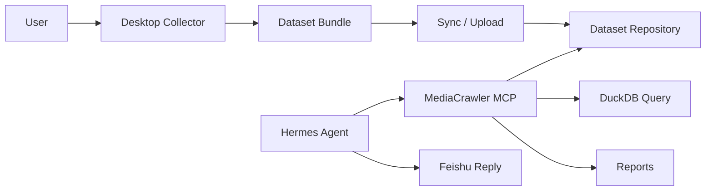

# 桌面采集与数据集 MCP 架构改造方案

## 1. 背景与结论

本方案是在服务器 QR worker 实测后形成的架构调整。当前结论是：

```text
主链路不再让 Hermes 通过 MCP 在服务器上完成小红书扫码登录和实时采集。

主链路改为：
桌面端真实浏览器采集数据 -> 数据集落盘或同步 -> 服务器 MCP 提供查询、分析和报告。
```

这不是否定 MediaCrawler MCP，而是重新放置它的能力边界。小红书登录、滑块、风险验证和 Cookie 写入高度依赖真实用户浏览器环境，服务器上的 Playwright headless 或 persistent context 即使补齐部分指纹，也不能稳定等价于用户日常浏览器。

改造后的产品定位：

- 桌面采集端负责平台登录、人工接管、低频采集和原始数据归档。
- 数据集存储层负责标准目录、元信息、原始 JSONL、图片素材和同步。
- MediaCrawler MCP 负责数据集登记、标准化、查询、报告和 Agent 可复用分析。
- Hermes Agent 负责理解用户意图、调用 MCP、生成自然语言回答和飞书交互。

## 2. 架构决策

### 2.1 新主决策

采用“桌面采集 + 数据集 MCP”的两段式架构。

```text
Desktop Collector
  - real Chrome / CDP / headful Playwright
  - user-controlled login and verification
  - low-frequency collection
  - raw dataset export

Dataset Repository
  - dataset.json
  - raw JSONL
  - media files
  - logs
  - sync manifest

MediaCrawler MCP
  - dataset registry
  - normalize JSONL to DuckDB
  - query historical datasets
  - generate reports
  - expose stable tools to Hermes

Hermes Agent
  - dataset discovery
  - query orchestration
  - report summarization
  - Feishu response
```

### 2.2 默认不暴露的实验采集能力

以下能力仅保留为诊断、兼容旧流程或低频实验能力，不作为生产主链路，并且默认不注册为 MCP tools：

- `get_login_status`
- `import_cookies`
- `start_qrcode_login`
- `get_qrcode_login_status`
- `cancel_qrcode_login`
- `start_collection`
- `get_task_status`
- `cancel_task`

默认启动的 MediaCrawler MCP Server 不应暴露这些工具给 Hermes Agent。Hermes 在默认配置下看不到这些工具，也不得主动调用它们。只有通过启动参数、配置项或单独 MCP server 显式启用 `experimental_collection` profile 时，它们才可以注册。

### 2.3 Tool Profile 决策

MediaCrawler MCP 使用 tool profile 控制对 Hermes 暴露的接口。默认 profile 是 `dataset`。

#### 默认 profile：`dataset`

默认启动时只启用该 profile：

```text
media-crawler-mcp --profile dataset
```

或配置：

```yaml
tools:
  dataset: true
  experimental_collection: false
```

包含工具：

```text
create_dataset
register_dataset
validate_dataset_bundle
import_raw_files
sync_dataset_manifest
list_datasets
get_dataset
normalize_dataset
query_dataset
generate_report
get_report
```

#### 实验 profile：`experimental_collection`

该 profile 默认关闭，必须显式启用：

```text
media-crawler-mcp --enable-experimental-collection
```

或配置：

```yaml
tools:
  dataset: true
  experimental_collection: true
```

包含工具：

```text
get_login_status
import_cookies
start_qrcode_login
get_qrcode_login_status
cancel_qrcode_login
start_collection
get_task_status
cancel_task
```

约束：

- 不建议在 Hermes 生产 bot 中启用。
- 不允许 Hermes 默认主动调用。
- 仅用于诊断服务器环境、兼容旧流程、验证飞书图片上传或做低频实验。
- 启用后应在 Hermes 提示词或工具策略中明确标记为“需要用户显式要求”。

## 3. 推荐总体架构



### 3.1 桌面采集端

桌面采集端是新的采集主入口。它可以是：

- 现有 MediaCrawler CLI 的本机使用方式。
- 一个后续新增的轻量桌面应用。
- 一个本机脚本，连接用户已有 Chrome 的 CDP。

桌面采集端必须允许用户在可视化浏览器里完成：

- 扫码登录。
- 滑块验证。
- 风险验证。
- 账号切换。
- 采集前人工确认。

桌面端不需要直接接入 Hermes，不需要实现 MCP。它只需要输出标准数据集目录。

### 3.2 数据集仓库

数据集仓库是桌面端和 MCP 之间的稳定接口。推荐目录：

```text
datasets/
  ds_20260705_xhs_ai_coding_side_job/
    dataset.json
    raw/
      xhs_contents.jsonl
      xhs_comments.jsonl
    media/
      images/
    logs/
      collect.log
    analysis.duckdb
    reports/
      report.md
      report.html
      summary.json
```

`dataset.json` 是核心 manifest，最低字段：

```json
{
  "dataset_id": "ds_20260705_xhs_ai_coding_side_job",
  "name": "AI 编程副业小红书反馈",
  "source": "desktop_collector",
  "platforms": ["xhs"],
  "keywords": ["AI编程副业", "程序员接单"],
  "created_at": "2026-07-05T12:00:00+08:00",
  "collector": {
    "name": "mediacrawler-desktop",
    "version": "0.1.0",
    "host": "user-desktop"
  },
  "files": {
    "raw_contents": "raw/xhs_contents.jsonl",
    "raw_comments": "raw/xhs_comments.jsonl"
  },
  "metrics": {
    "raw_content_count": 0,
    "raw_comment_count": 0
  }
}
```

### 3.3 MediaCrawler MCP

MediaCrawler MCP 的主要能力改为数据集侧深模块。默认对 Hermes 暴露的外部接口应少而稳定：

- 登记已有数据集。
- 列出和读取数据集。
- 标准化数据集。
- 查询数据集。
- 生成报告。
- 返回报告路径和摘要。

MCP 不应把“能否登录小红书”作为主流程前置条件。没有新数据时，Hermes 应提示用户用桌面端采集，而不是在服务器上持续重试登录。默认 `dataset` profile 中不注册任何登录、cookie、二维码或服务器实时采集工具。

## 4. 模块与接口边界

本改造按 deep module 思路设计：每个模块暴露小接口，把平台差异、路径处理、格式兼容和错误恢复藏在实现里。

### 4.1 外部接口

默认 `dataset` profile 暴露以下工具。

数据集接口：

```text
create_dataset(name, platforms, keywords, description?)
register_dataset(dataset_dir, import_mode="copy|link")
validate_dataset_bundle(dataset_dir)
import_raw_files(dataset_id, contents_path?, comments_path?, platform, source_keyword?)
sync_dataset_manifest(dataset_id)
list_datasets(keyword?, platform?, status?, limit?)
get_dataset(dataset_id)
normalize_dataset(dataset_id, force=false)
query_dataset(dataset_id, query, target="comments", platform?, source_keyword?, limit?, sort_by?)
generate_report(dataset_id, report_type="topic_research", top_n=20)
get_report(dataset_id, report_id?)
```

实验采集工具不属于默认外部接口，详见 [Appendix A：Experimental Server Collection Tools](#appendix-aexperimental-server-collection-tools)。

### 4.2 `DatasetRegistry` 模块

接口职责：

- 登记一个已有目录。
- 创建或更新 SQLite 元数据。
- 校验 `dataset.json`。
- 解析 raw 文件路径。
- 维护 dataset 状态。

接口建议：

```text
register_dataset(dataset_dir, import_mode) -> Dataset
get_dataset(dataset_id) -> Dataset
list_datasets(filters) -> list[Dataset]
update_metrics(dataset_id, metrics) -> Dataset
```

### 4.3 `DatasetImporter` 模块

接口职责：

- 从桌面导出的目录或文件导入服务器。
- 支持 copy 和 link 两种模式。
- 统一 raw 文件命名。
- 补齐缺失的 manifest 字段。

接口建议：

```text
import_bundle(path, import_mode) -> ImportResult
import_raw_files(dataset_id, files, metadata) -> ImportResult
validate_bundle(path) -> ValidationResult
```

### 4.4 `Normalizer` 模块

接口职责保持不变，但要假设数据来自多种采集端：

- MediaCrawler CLI。
- 桌面应用。
- 手工整理的 JSONL。
- 后续其他采集器。

要求：

- 字段缺失不崩溃。
- 数字字段安全转换。
- `source_keyword` 缺失时从文件名、manifest 或导入参数补齐。
- `raw_json` 必须保留。

### 4.5 `CrawlerRunner` 模块

`CrawlerRunner` 降级为可选适配器，不再是 MCP 主路径核心。

保留原因：

- 调试时可快速触发一次采集。
- 部分平台或账号环境可能仍能在服务器跑通。
- 后续桌面端也可能复用它的参数构造逻辑。

限制：

- 默认不注册任何依赖 `CrawlerRunner` 的 MCP tool。
- 默认关闭服务器首次登录和服务器实时采集。
- 未登录时快速返回可恢复错误。
- 不做验证码绕过。
- 不承诺生产稳定性。

## 5. 技术选型调整

### 5.1 不变的选型

```text
MCP 形态: stdio
元数据: SQLite + WAL
原始数据: JSONL
分析查询: DuckDB
报告输出: Markdown + HTML + JSON summary
飞书集成: Hermes 负责
```

这些选型仍然适合单机 Hermes 服务器和本地数据集分析。

### 5.2 调整的选型

```text
采集执行:
  原方案: MCP server subprocess 直接触发 MediaCrawler
  新方案: 桌面端真实浏览器采集为主，服务器 subprocess 采集为实验能力

登录态:
  原方案: 服务器 persistent context / CDP / cookie import
  新方案: 桌面真实浏览器和人工接管为主，服务器登录能力仅兜底

任务模型:
  原方案: collection task 是核心任务
  新方案: import / normalize / query / report 是核心任务

MCP 工具:
  原方案: create dataset 后可直接 start_collection
  新方案: 默认只启用 dataset profile，优先 register/import 已采集数据集，再 normalize/query/report
```

### 5.3 新增建议依赖

短期不需要新增重型依赖。可继续使用：

- SQLite
- DuckDB
- pandas
- jieba
- wordcloud
- MCP Python SDK

后续如果需要桌面应用，可再评估：

- Tauri 或 Electron，用于桌面壳。
- 本地 FastAPI，用于桌面 UI 调用采集。
- `watchdog`，用于监听数据集目录同步。

桌面端第一版不建议一开始上 Electron。更轻的方式是先做本机 CLI 或简单 Web UI，跑通数据集导出规范。

## 6. Hermes 工作流

### 6.1 查询已有数据

```text
User: 上次抓到的数据里，大家最担心接单什么风险？
Hermes:
  1. list_datasets(keyword="接单")
  2. query_dataset(dataset_id, query="风险 不靠谱 付款 甲方", target="comments")
  3. get_report(dataset_id) 或 generate_report(dataset_id)
  4. 汇总证据并回复
```

### 6.2 没有数据时

```text
User: 帮我调研小红书上 AI 编程副业反馈。
Hermes:
  1. list_datasets(keyword="AI编程副业")
  2. 没有合适数据集
  3. 回复用户需要先用桌面采集端采集
  4. 给出推荐关键词和采集范围
  5. 数据集同步后再 register_dataset / normalize_dataset / generate_report
```

### 6.3 新数据导入后

```text
Desktop Collector:
  1. 采集小红书内容和评论
  2. 输出 dataset bundle
  3. 同步到 Hermes 服务器

Hermes:
  1. register_dataset(dataset_dir)
  2. normalize_dataset(dataset_id)
  3. generate_report(dataset_id)
  4. 回复报告摘要和路径
```

## 7. 迁移计划

### Phase A：文档和接口收敛

- 明确服务器二维码登录和实时采集默认不注册为 MCP tools。
- 新增 `dataset` 与 `experimental_collection` tool profile。
- 新增桌面采集数据集规范。
- 更新 PRD、工程设计和开发任务拆分。
- 在 MCP 启动配置中默认关闭 `experimental_collection`。

### Phase B：数据集导入能力

- 新增 `register_dataset`。
- 新增 `validate_dataset_bundle`。
- 新增 `import_raw_files`。
- 支持从任意目录注册已有 raw JSONL。
- 为导入数据集补齐 `dataset.json`。

### Phase C：桌面采集最小闭环

- 使用现有 MediaCrawler 本机 CDP 模式完成采集。
- 输出符合本方案的 dataset bundle。
- 手动或脚本同步到服务器。
- Hermes 通过 MCP 完成 normalize、query、report。

### Phase D：体验增强

- 做本机轻量 UI 或桌面壳。
- 支持一键打包数据集。
- 支持同步到服务器目录。
- 支持采集前关键词建议和采集后质量检查。

### Phase E：服务器实时采集重新评估

只有当某个平台登录稳定、验证成本低、失败可恢复时，才考虑把服务器实时采集放入单独 profile 或单独 MCP server。小红书当前不满足这个条件，不能进入默认 `dataset` profile。

## 8. 风险与应对

### 8.1 数据同步复杂度

风险：桌面采集和服务器分析分离后，需要把数据传到服务器。

应对：

- 第一版支持手工复制目录。
- 后续支持 rsync、SFTP、共享网盘或对象存储。
- 数据集 bundle 用相对路径，降低迁移成本。

### 8.2 数据格式漂移

风险：桌面端、CLI 和未来采集器输出字段不完全一致。

应对：

- `dataset.json` 记录 collector 名称和版本。
- Normalizer 做宽容字段映射。
- 保留 `raw_json` 便于回溯。
- 给 `validate_dataset_bundle` 输出可读 warning。

### 8.3 Agent 误触发采集

风险：Hermes 仍然频繁调用服务器实时采集工具。

应对：

- 默认不注册服务器实时采集工具，让 Hermes 在默认配置下不可见、不可调用。
- 只有用户显式要求诊断或实验时，才启用 `experimental_collection` profile。
- 默认工作流优先查询已有数据集。
- 没有数据时让 Hermes 提示用户去桌面采集。
- 启用实验 profile 时，大数量采集必须由用户明确确认。

### 8.4 合规与账号风险

风险：自动化绕过验证或高频采集带来账号风险。

应对：

- 不做验证码绕过。
- 桌面端保留人工接管。
- 默认低频、小批量。
- 不使用个人主账号做长期服务端自动化。
- 报告分享前提示人工确认公开评论内容是否需要脱敏。

## 9. 验收标准

新架构第一阶段验收：

- Hermes 能通过 MCP 列出、读取已有数据集。
- MCP 能注册一个桌面导出的数据集目录。
- MCP 能从 raw JSONL 生成 DuckDB。
- `query_dataset` 能检索历史评论和内容。
- `generate_report` 能输出 Markdown、HTML、summary JSON。
- 没有可用数据集时，Hermes 给出桌面采集建议，而不是反复触发服务器扫码。
- 默认 Hermes 工具列表中不存在 QR、login、cookie、server collection 相关工具。

第二阶段验收：

- 桌面端能通过真实 Chrome 完成小红书登录和采集。
- 桌面端能输出标准 dataset bundle。
- bundle 可复制到服务器并成功 `register_dataset`。
- 同一数据集可被 Hermes 多轮追问复用。

## 10. 当前实现影响

当前 `mediacrawler_mcp` 已经具备有价值的主链路基础：

- `create_dataset`
- `list_datasets`
- `get_dataset`
- `normalize_dataset`
- `query_dataset`
- `generate_report`
- `get_report`

需要新增或调整：

- 新增 `register_dataset`。
- 新增 `validate_dataset_bundle`。
- 新增 `import_raw_files`。
- 新增 `sync_dataset_manifest`。
- 为 MCP server 增加 tool profile 注册门控。
- 默认只注册 `dataset` profile。
- 将 `start_qrcode_login`、`start_collection` 等工具移入 `experimental_collection` profile，默认不注册。
- 更新 Hermes 集成验证文档，优先验证离线数据集分析闭环。

## 11. 推荐下一步

优先开发顺序：

1. 文档同步和工具定位收敛。
2. 实现 `register_dataset`。
3. 实现 `validate_dataset_bundle`。
4. 实现 `import_raw_files`。
5. 实现 `sync_dataset_manifest`。
6. 给 MCP server 加 `dataset` / `experimental_collection` profile 注册门控。
7. 给现有桌面 CLI 采集结果增加 dataset bundle 导出脚本。
8. 在 Hermes 侧改默认提示词和工具使用策略，优先查询已有数据集。

这条路线能尽快保住 MCP 的核心价值，同时把最不稳定的平台登录环节移回用户可接管的真实浏览器环境。

## Appendix A：Experimental Server Collection Tools

本附录记录默认不暴露给 Hermes 的实验采集工具。它们只在 `experimental_collection` profile 显式启用时注册。

启用方式示例：

```text
media-crawler-mcp --enable-experimental-collection
```

或：

```yaml
tools:
  dataset: true
  experimental_collection: true
```

工具列表：

```text
get_login_status
import_cookies
start_qrcode_login
get_qrcode_login_status
cancel_qrcode_login
start_collection
get_task_status
cancel_task
```

使用约束：

- Hermes Agent 默认不得主动调用这些工具。
- 仅用于诊断、兼容旧流程、低频实验和服务器环境排查。
- 不用于推荐产品主链路。
- 不用于绕过验证码、滑块或平台安全校验。
- 启用后应在部署说明中记录启用原因、账号范围、采集频率和关闭条件。
